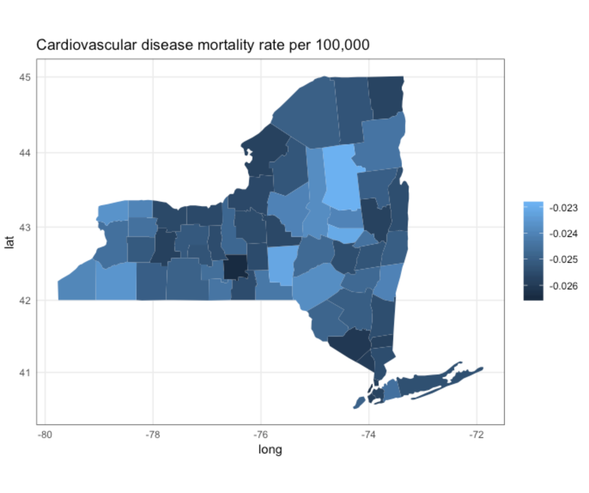

```{r setup, include=FALSE}
knitr::opts_chunk$set(echo = TRUE,
                      cache = TRUE,
                      message = FALSE,
                      include = FALSE)
```

```{r packages, include = FALSE}
library(tidyverse)
library(readr)
library(caret)
library(naniar)
```

```{r datasets}
cause_of_death <- read_delim("cause_of_death.txt", 
    ":", escape_double = FALSE, col_names = FALSE, 
    trim_ws = TRUE) 
```


#Excecutive Summary
Understanding the impact of a patient's community health status is essential for population-wide health improvement and better delivery of health care. We hypothesize that a cluster of high-risk features among NY counties, encompassing socio-environmental, behavioral, and other risk factors can distinguish counties at higher risk. Therefore, we propose to develop an algorithm that would differentiate the NY counties relatively protected versus at higher risk for poor health. The development of a risk score would allow health professionals to intervene specific counties more aggressively based on their population-level risk scores and would provide a motivational tool for patients to engage in healthy lifestyle choices. The risk algorithm may also be helpful for policy makers in targeting resources to manage populations at risk. Moreover, by appropriately identifying a subgroup of areas or communities with excess health risk, further investigations can be straightforward for managing future patients and/or designing new clinical trials and research projects. 
Based on the predictions we were able to identify an association of healthy food-supplying shops and premature cardiovascular disease. We suggest policy actions to increase the availability of these foods to all residents in NYS.

#Technical Exposition
The New York state prevention [agenda](https://www.health.ny.gov/prevention/prevention_agenda/2013-2017/) identied 5 areas of focus:

* The prevention of chronic diseases, such as cardiovascular diseases  
* The promotion of a healthy enviomnent  
* The promotion of healthy women and infants  
* The promotion of mental health  
* The prevention of sexually transmitted diseases  

Today, cardiovascular disease and cancer are the greatest [causes](https://www.cdc.gov/nchs/fastats/deaths.htm) of overall mortality in the United States. 

```{r, message=FALSE}
cause_of_death%>%
  arrange((X2)) %>%
  mutate(X1 = factor(X1, levels = X1)) %>%
  ggplot(aes(X1, X2)) + 
  geom_bar(stat = "identity") + 
  theme_classic() + coord_flip() + 
  labs(y = "Number of deaths in 2015 across the USA",
       x = NULL)
```

The incidence and progression of cardiovascular disease is tightly associated to life-style, enviomnental factors and pre-disposing conditions such as smoking, obesity and diabetes. While cancer is certainly influenced by non-genetic factors, their impact and dynamics are less well understood.
Based on this, we decided to focus on cardiovascular disease and how conditions associated with this disease are influenced by societal and politically actionable factors, such as food hygiene, availability, insurance and income. To identify regions in New York state that requiere focused attention by public health services, we made use of the spacial information present in all datasets.

##Target variable identification

We first inspected the health outcome dataset to identify medical indicators associated with cardiovascular health. We cleaned the dataset, filtered for data that was measured in New York state and removed measurments in which the measurment quality was described as *Unstable Estimate*. Finally we scaled the measurment values (ratios and percentages) with a z-scaling. 

```{r}
community_health <- read_csv("datathon/community_health.csv")
# Let's first do a data cleaning for community health data
# Looks like some of the estimates are unstable - get rid of these
community_health <-community_health %>% dplyr::filter(data_comment == "Data Suppressed" | is.na(data_comment))

# Remove State-level Data
community_health<-community_health %>% filter(county_name != "New York State")

# Get Rid of NA's
community_health<-community_health[!is.na(community_health$precent_or_rate),]

# Z-score the precent_or_rate variable
community_health$precent_or_rate<-scale(community_health$precent_or_rate)
```

We identified early on, that the majority of health related data was measured in a time window between **2012 - 2014**. Hence, we dropped all measurement from other timepoints and extended these filter criteria to other related datasets.

```{r}
#table(community_health$year) %>% 
community_health %>%
  ggplot(aes(year)) + 
  geom_bar() + 
  theme_classic() + 
  labs(x = "Time windows")
```

After preparing the dataset, we filtered for health indicators that are directly and indireclty related to the cardiovascular health. These topics inlcuded the following:

```{r}
c("Cardiovascular Disease Indicators", "Cirrhosis/Diabetes Indicators", "Obesity and Related Indicators",
                             "Socio-Economic Status and General Health Indicators", "Tobacco, Alcohol and Other Substance Abuse Indicators")
```

Each indicator class is linked to a set of direct measurments such as:

```{r}
indicator_vector <- community_health %>% 
  filter(health_topic %in% c("Cardiovascular Disease Indicators", "Cirrhosis/Diabetes Indicators", "Obesity and Related Indicators",
                             "Socio-Economic Status and General Health Indicators", "Tobacco, Alcohol and Other Substance Abuse Indicators"))%>% 
           .$indicator %>% unique()
     
indicator_vector %>% sample(5)
```

```{r}
colwise_community_health <- community_health %>% 
  filter(year == "2012-2014") %>% 
  filter(health_topic %in% c("Cardiovascular Disease Indicators", "Cirrhosis/Diabetes Indicators", "Obesity and Related Indicators",
                             "Socio-Economic Status and General Health Indicators", "Tobacco, Alcohol and Other Substance Abuse Indicators")) %>%
  dplyr::select(county_name, indicator, precent_or_rate) %>% 
  group_by(county_name, indicator) %>% 
  summarise(precent_or_rate = mean(precent_or_rate, na.rm = FALSE)) %>%
  spread(indicator, precent_or_rate)
 
  
```

After selecting the revelant set of indicators, we checked for missing values. We removed a false county labels for NY state and selected outcome measures with more than 10% of events missing.

```{r}
vis_miss(colwise_community_health) + 
  #theme_classic() +
  theme(axis.title.x=element_blank(),
        axis.text.x=element_blank(),
        axis.ticks.x=element_blank())
```

```{r}
remove_features <- colwise_community_health %>% 
  filter(county_name != "New York State (excluding NYC)") %>%
  ungroup() %>%
  summarise_all(funs(sum(is.na(.)))) %>% 
  gather() %>% 
  arrange(desc(value)) %>% 
  filter(value >= round(nrow(colwise_community_health)/10,1)) %>% 
  .$key
```

```{r}
colwise_community_health_filtered <- community_health %>% 
  filter(year == "2012-2014") %>% 
  filter(health_topic %in% c("Cardiovascular Disease Indicators", "Cirrhosis/Diabetes Indicators", "Obesity and Related Indicators",
                             "Socio-Economic Status and General Health Indicators", "Tobacco, Alcohol and Other Substance Abuse Indicators")) %>%
  filter(county_name != "New York State (excluding NYC)") %>%
  dplyr::filter(!indicator %in% c(remove_features)) %>%
  dplyr::select(county_name, indicator, precent_or_rate) %>% 
  group_by(county_name, indicator) %>% 
  summarise(precent_or_rate = mean(precent_or_rate, na.rm = FALSE)) %>%
  spread(indicator, precent_or_rate)
```

```{r}
drop_cor_col <- colwise_community_health_filtered %>%
  #for orientation only
  drop_na() %>%
  ungroup() %>%
  dplyr::select(-county_name) %>%
  cor() %>%
  findCorrelation(cutoff = 0.8)

keep_col <- colwise_community_health_filtered[,-c(drop_cor_col,27)] %>%
  colnames()

write.csv(keep_col, "keep_col.csv")
```

After preparing the data and cleaning missing values, we identied outcome variables with a low degree of overall correlation *(r < 0.8)*. The final list **30** of cardiovascular outcome variables include: 

```{r}
keep_col[-27] %>% sample(5)
```

##Data preparation
After identifying key cardiovascular health indicators, we went throught the available datasets


QC, common error types?

###Data interoperability
To ensure interoperability between the datasets, we had to summarise every interacting dataset with its acompanying features to a county level. We wondered wether a borough or an NTA in New York City would match the county level data across New York state. Therefore we compared the mean population of each unit type. 

```{r pop_ze, echo=FALSE, fig.cap="Population sizes", out.width = '100%'}

```

Based on this bar chart, we decided not to use NTA, and accept boroughs as giant counties.
The *311* dataset, comprising diverse residential complaints across the state was not annotated by county. Hence, we used a zip-to-county dataset from [data.ny.gov](https://data.ny.gov/Government-Finance/New-York-State-ZIP-Codes-County-FIPS-Cross-Referen/juva-r6g2/data) to convert the data. 


###Feature engineering
We performed feature engineering at third points during the analysis.

First, we recognized that the type of complaints in the *311* dataset was very diverse and had a large tail. Hence, we kept only the  the 5 largest groups of complaints and summarized all other datapoints into *other*. The count of complaints for different reasons was afterwards: (Water System 34.3%, Dirty Conditions 18.5%, Sanitation Condition 15.8%, Rodent 13.8%, and Others 17.7%).

Second, we wanted to use the available restaurant dataset to not only understand spacial location of the restaurants/stores, but also the nutritional characterisitcs of the provided food. Thus, we extracted recurring descriptive strings from the *categories* columns, grouped them semantically and used these as additional features. The resulting features included tags such as: *healthy*, *alcoholic_beverages*, *meat*, *european*, *asian*. 

Third, we had to average and summarize multiple features during county-wise aggregation.

##Data exploration 
We aggregated *311* data, food service visit, and restaurant types.
We did not include radiation measurments for a lack of obvious medical interaction. 
After grouping our predictive values, we performed a principal component analysis on the data and observed a strong difference between rural and metropolitan areas. 

```{r pop_size, echo=FALSE, fig.cap="PCA", out.width = '100%'}

```

The loadings for the first principal component were strongly associated with the rate of health insurance, which varies a lot between counties. Moreover, the rate of healthy food supppliers had a strong loading.

```{r , echo=FALSE, fig.cap="PC1 Laoding", out.width = '100%'}

```

Do avoid pre-analysis bias, we performed no ad-hoc hypothesis testing during EDA and data-wrangling.
Next to a strong impact of insurance coverage and healthy food supply, we found an association between food hygene and the incidence of cardiovascular events.

```{r , echo=FALSE, fig.cap="Cardiovascular events", out.width = '100%'}

```


```{r, echo=FALSE, fig.cap="Food violations", out.width = '100%'}

```


##Data  analysis 

We next build a linear model based on the non health related features collected as described above. 
Model validation was done by using optimism-corrected R2 statistics. To obtain these estimates, we first develop the prediction model in the development cohort per health indicator, and then generate a bootstrap sample by sampling individuals with replacement from the original sample. After generating at least 100 bootstrap samples, the optimism-corrected model performance was obtained by subtracting the estimated mean of the optimism estimate value from the R2 in the original sample. In our example study, with 500 bootstrap replications, the estimated optimism and the optimism-corrected R2 showed good discrimination. 
Based on the predictions we were bale to identify a association of healthy food-supplying shops and premature cardiovascular disease. We suggest policy actions to increase the availability of these foods to all residents in NYS.

Plotted are regions with a high predicted risk of premature cardiovascular disease based on the validated linear model.

```{r, echo=FALSE, fig.cap="Food violations", out.width = '100%'}
knitr::include_graphics("fig.png")
```
Conclusions: In summary, we provide an easily assessed, clinically relevant risk prediction tool to enhance decision-making for health professionals regarding factors contributing importantly to health risk in NY state. Policy-makers may also find these results helpful in targeting resources to manage populations at risk


#Appendix
##Caveats and future research
The data we used for curating **healthy** restaurants and food suppliers was solely based on the dataset intrinsic description. We were not able to validate these findings with third party data in the limited amount the time. 
##Session Info

```{r}
sessionInfo()
```

